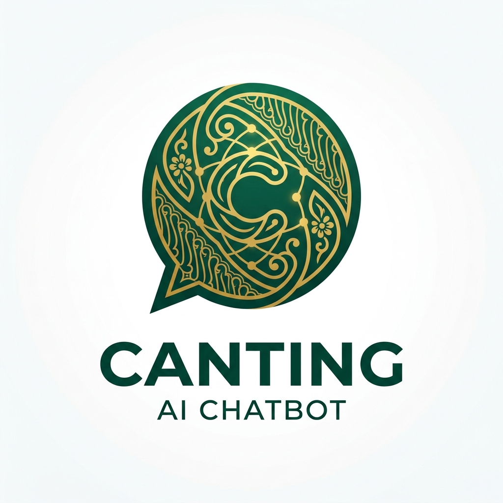

# 🎨 CANTING (Catat Penting) - Hackathon Antigravity 2026



> **Empowering Batik SMEs in Surabaya with Agentic AI.**

**CANTING** is an innovative Agentic AI solution designed specifically to transform the operations of Batik SMEs in Surabaya from complex manual systems into a "light and fast" digital ecosystem. Aligned with the Antigravity theme, this project addresses the challenge of operational drag—including manual inventory management, slow payment verification, and repetitive customer support—that currently hinders the productivity of 385,054 SMEs in Surabaya.

---

## 🚀 Current Progress: Phase 1 - UI/UX & Modular Architecture

We have successfully completed the foundation of the CANTING Dashboard, focusing on a premium, highly responsive UI and a scalable component-based architecture.

### Key Milestones Completed:
- **Modular Component Design**: Refactored complex UI into reusable, type-safe components:
  - `PesananTable`: Centralized order management with status-aware badges.
  - `StokTable`: Comprehensive inventory tracking with low-stock alerts.
  - `DocumentLibrary`: Robust knowledge management for chatbot RAG.
  - `ActiveShipmentList` & `ShipmentTrackingMap`: Real-time delivery monitoring UI.
  - `StatCard` (SummaryCard): Versatile dashboard statistics cards.
- **Responsive Dashboard Layout**: A unified sidebar navigation system with a polished, modern aesthetic.
- **Dynamic Pages**: Implemented full layouts for:
  - **Dashboard Overview**: Quick stats and recent activities.
  - **Pesanan**: Detailed order management.
  - **Stok Barang**: Inventory and SKU monitoring.
  - **Pengiriman**: Real-time shipment tracking.
  - **Pengetahuan Produk**: Chatbot RAG (Retrieval-Augmented Generation) management.
  - **Laporan**: Automated report generation and download history.
  - **Komplain**: Customer complaint and refund resolution.

---

## 🛠️ Tech Stack

- **Core Framework**: [Next.js](https://nextjs.org/) (App Router)
- **AI Engine**: [Google Gemini 1.5 Flash](https://ai.google.dev/)
- **Styling**: [Tailwind CSS](https://tailwindcss.com/)
- **Icons**: [Lucide React](https://lucide.dev/)
- **State Management**: React Hooks (useState, useEffect)
- **Database**: [Supabase](https://supabase.com/) (PostgreSQL)

---

## 🔌 Backend API Documentation

The dashboard is designed to integrate with the Canting Backend API. You can find the full documentation and endpoint specifications here:

👉 **[Canting API Documentation](https://api-stg.canting.my.id/docs)**

### Main Modules Covered:
- **Owner Management**: Authentication and user control.
- **Inventory Service**: SKU tracking and stock updates.
- **Order Processing**: Payment verification and status updates.
- **Knowledge Base**: Endpoints for feeding data to the RAG system.

---

## 🏁 Getting Started

### Prerequisites
- Node.js 18+
- npm / pnpm / yarn

### Installation
1. Clone the repository:
   ```bash
   git clone https://github.com/AdnanBayu/canting-chatbot-hackathon.git
   cd canting-chatbot-hackathon
   ```
2. Install dependencies:
   ```bash
   npm install
   ```
3. Configure Environment Variables:
   Create a `.env.local` file:
   ```env
   NEXT_PUBLIC_SUPABASE_URL=your_supabase_url
   NEXT_PUBLIC_SUPABASE_ANON_KEY=your_supabase_anon_key
   GEMINI_API_KEY=your_gemini_api_key
   ```
4. Run the development server:
   ```bash
   npm run dev
   ```

Open [http://localhost:3000](http://localhost:3000) to see the dashboard.

---

## Cultural Preservation
Beyond operational efficiency, CANTING serves as a strategic tool for cultural preservation. By removing technical and administrative burdens, we empower local batik artisans to focus on their craft while remaining competitive in the global e-commerce market.